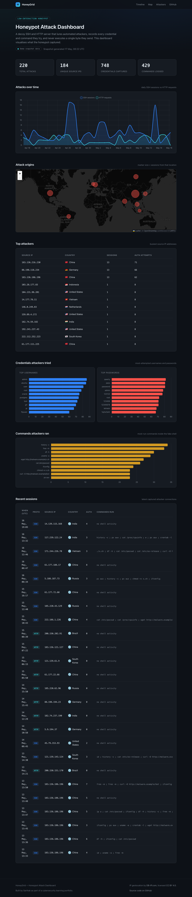

# honeypot-attack-dashboard

> A low-interaction SSH & HTTP honeypot that lures automated attackers, logs every
> credential and command they try, and visualises the captured attacks on a live dashboard.


[](LICENSE)

[](https://sarthakagrwal.github.io/honeypot-attack-dashboard/)

## Live demo

**https://sarthakagrwal.github.io/honeypot-attack-dashboard/**

The deployed dashboard renders a bundled snapshot of captured attack data. Point it at a
running honeypot's API (see [Deploying to a VPS](#deploying-to-a-vps)) and the *same*
dashboard shows live traffic.

## What it does

`honeypot-attack-dashboard` runs fake SSH and HTTP services that look like a poorly-secured
server. Automated attackers and scanners find them, try to brute-force logins, and — once
the SSH service "lets them in" — run their post-compromise commands inside a *simulated*
shell. Every login attempt, command and HTTP probe is recorded to a SQLite database, and a
polished Vite + TypeScript dashboard turns that data into charts, a world attack-origin map
and tables.



> The screenshot above is generated from the bundled demo dataset; the live site looks
> identical and is updated on every deploy.

## Safety

**This is a *low-interaction* honeypot. It SIMULATES services and never executes,
evaluates or interprets anything an attacker sends.** Safety is the project's primary
design constraint, not an afterthought:

- **No execution path for attacker input.** The `honeypot/` package contains zero use of
  `subprocess`, `os.system`/`os.popen`/`os.exec*`, `eval`, `exec`, `compile`, `pty`, or
  unpickling of attacker data. The fake SSH shell is a pure dictionary lookup that returns
  hard-coded strings; unknown input returns a canned `command not found`. The HTTP server
  only *parses* request bodies (for credential fields) — it never interprets them.
- **This is enforced by a test.** [`tests/test_no_exec.py`](tests/test_no_exec.py)
  statically scans every `.py` file in `honeypot/` — at both the token and AST level — and
  fails the build if any forbidden execution primitive appears. The guarantee cannot
  silently regress.
- **Runs unprivileged.** Default ports are non-privileged (SSH `2222`, HTTP `8080`) so the
  honeypot runs as a normal user, never root. On a real deployment a host-side `iptables`
  redirect sends port-22 traffic to it without granting the process any privilege.
- **Bounded resources.** Every connection has a timeout, and a global counting semaphore
  caps concurrent connections so a flood cannot exhaust threads. Command length and the
  number of commands per session are both capped.
- **Deploy on a disposable host only.** A honeypot deliberately attracts hostile traffic.
  Run it on a dedicated, throw-away VPS with nothing else of value, and move your real
  admin SSH to another port first. See [`deploy/VPS-DEPLOYMENT.md`](deploy/VPS-DEPLOYMENT.md).

## Features

- **Fake SSH service** — a realistic OpenSSH banner, password auth that logs every attempt
  and "accepts" a login after a few tries to unlock a *simulated* shell.
- **Simulated interactive shell** — convincing canned output for `ls`, `whoami`, `uname -a`,
  `cat /etc/passwd`, `ps aux`, `wget`/`curl` and more; everything typed is logged, nothing
  is run.
- **Fake HTTP service** — decoy pages for common attack targets (`/admin`, `/wp-login.php`,
  `/phpmyadmin`, `/.env`, `/.git/config`, …), a spoofed `Apache/2.4.52 (Ubuntu)` banner,
  and full logging of every request including POSTed credentials.
- **GeoIP enrichment** — attacker IPs are geolocated (DB-IP IP-to-City Lite) for the world
  map, with graceful degradation when the database is absent.
- **SQLite capture store** — WAL-mode database; one event funnel shared by SSH, HTTP and
  the synthetic-data seeder.
- **Read-only API** — a FastAPI service exposing the captured data over GET-only routes.
- **Live dashboard** — timeline chart, Leaflet world map, top-attacker / recent-session
  tables and credential + command bar charts, auto-refreshing every 30 seconds.
- **Deterministic demo data** — a seed generator produces a believable 30-day attack
  history so the dashboard is rich even before the honeypot has run live.

## How it works

```
        ┌─────────────┐     ┌─────────────┐
attacker│  SSH :2222  │     │  HTTP :8080 │ attacker
  ─────▶│ (paramiko)  │     │ (http.server)│ ◀─────
        └──────┬──────┘     └──────┬──────┘
               │   events.py funnel │
               └─────────┬──────────┘
                         ▼
                 SQLite (WAL)  honeypot.db
                         │
                         ▼
              api/main.py  (FastAPI, GET-only, read-only DB)
                         │  /api/export
                         ▼
              web/  Vite + TypeScript dashboard
```

The **SSH honeypot** uses [paramiko](https://www.paramiko.org/) for the SSH *transport*
only — key exchange, framing and encryption. paramiko never runs commands; the shell
channel is handed to a pure-lookup fake shell. Authentication is refused for the first few
attempts then "accepted", which mimics a weak server and keeps brute-force tools engaged so
they reveal their playbook.

The **HTTP honeypot** is a `ThreadingTCPServer` serving static decoy pages. It logs every
request and parses form-encoded / JSON bodies for credential-like fields, but authentication
never succeeds.

Both protocols write through a single funnel (`honeypot/events.py`), so live capture and
the synthetic seed data share one schema and one code path. The **API** opens the database
strictly read-only and exposes GET routes only. The **dashboard** fetches `/api/export`
from a live API when `VITE_API_BASE` is set, and otherwise renders the committed
`demo-data.json` snapshot — the exact same JSON shape, produced by the same builder.

## Quickstart

### Requirements

- Python 3.13+
- Node.js 24+ (for the dashboard)

### Install and run the honeypot

```bash
git clone https://github.com/Sarthakagrwal/honeypot-attack-dashboard.git
cd honeypot-attack-dashboard

# Set up a virtual environment and install the package.
python3 -m venv .venv
./.venv/bin/pip install -e ".[dev]"

# Generate the synthetic capture database (also writes the dashboard snapshot).
./.venv/bin/python scripts/generate_seed.py

# Run the honeypot. Default ports: SSH 2222, HTTP 8080, API 8000.
./.venv/bin/honeypot all          # SSH + HTTP + API together
# ...or individually:
./.venv/bin/honeypot ssh --port 2222
./.venv/bin/honeypot http --port 8080
./.venv/bin/honeypot api --port 8000
./.venv/bin/honeypot seed --out data/honeypot.db
```

With the honeypot running, try it locally — these connections are logged, never executed:

```bash
ssh -p 2222 root@127.0.0.1            # offers a fake shell after a few tries
curl http://127.0.0.1:8080/.env       # serves a decoy environment file
curl http://127.0.0.1:8000/api/stats  # the read-only dashboard API
```

### Run the dashboard locally

```bash
cd web
npm install
npm run dev        # local dev server
# or build the production site:
npm run build && npm run preview
```

By default the dashboard renders `web/public/demo-data.json`. To show live data, build it
with the API base set: `VITE_API_BASE=http://localhost:8000 npm run build`.

## Deploying to a VPS

To capture *real* attack traffic, run the honeypot on a small disposable internet-facing
server. The full runbook — Docker install, `docker compose up`, the host-side `iptables`
redirect of port 22, GeoIP download, and pointing the dashboard at the live API — is in
[`deploy/VPS-DEPLOYMENT.md`](deploy/VPS-DEPLOYMENT.md). Read its safety notes first.

```bash
docker compose -f deploy/docker-compose.yml up -d --build
```

## Testing

```bash
# Python: unit + integration tests (pytest) and lint (ruff).
./.venv/bin/pytest -q
./.venv/bin/ruff check .

# Web: unit tests (vitest) and end-to-end tests (Playwright).
cd web
npm run test
npx playwright install chromium
npm run test:e2e
```

The Python suite covers the database schema, the safety scan, the fake shell (hostile
input produces only a logged row), the SSH and HTTP servers end-to-end on ephemeral ports,
GeoIP degradation, the API (every route's shape, and that no mutating route exists) and the
deterministic seeder. The web suite unit-tests the data-aggregation layer and runs
Playwright against the built site to confirm the charts, map and tables render with no
console errors.

## Project structure

```
honeypot-attack-dashboard/
├── honeypot/              # Python core + CLI
│   ├── config.py          # frozen Config dataclass
│   ├── db.py              # SQLite schema, WAL, read-only helper
│   ├── events.py          # the single event funnel all protocols use
│   ├── geoip.py           # GeoIP lookup with graceful degradation
│   ├── ssh_server.py      # SSH honeypot (paramiko ServerInterface)
│   ├── fake_shell.py      # pure-lookup simulated shell — never executes input
│   ├── http_server.py     # HTTP honeypot serving decoy pages
│   ├── http_pages.py      # static bait page content
│   ├── seed.py            # deterministic synthetic attack history
│   ├── export.py          # the shared dashboard-data builder
│   └── cli.py             # argparse CLI: ssh / http / api / seed / all
├── api/main.py            # read-only FastAPI dashboard API (GET only)
├── tests/                 # pytest suite (incl. the static safety scan)
├── web/                   # Vite + TypeScript dashboard
│   ├── src/               # api.ts, charts.ts, map.ts, main.ts, …
│   ├── e2e/               # Playwright tests
│   └── public/demo-data.json   # the snapshot the live site renders
├── scripts/generate_seed.py    # builds the DB + the dashboard snapshot
└── deploy/                # Dockerfile, docker-compose, VPS runbook, GeoIP script
```

## Data sources / credits

- **IP geolocation** — [DB-IP.com](https://db-ip.com) IP-to-City Lite database, licensed
  [CC BY 4.0](https://creativecommons.org/licenses/by/4.0/). Attribution is shown in the
  dashboard footer.
- **Map tiles** — [CARTO](https://carto.com/attributions) dark-matter basemap, &copy;
  [OpenStreetMap](https://www.openstreetmap.org/copyright) contributors.
- The seed generator's credential and command lists are drawn from well-known public
  honeypot top-lists of real SSH brute-force and post-compromise activity.

## License

Released under the [MIT License](LICENSE).

---

*This project was built as part of a cybersecurity learning portfolio.*
